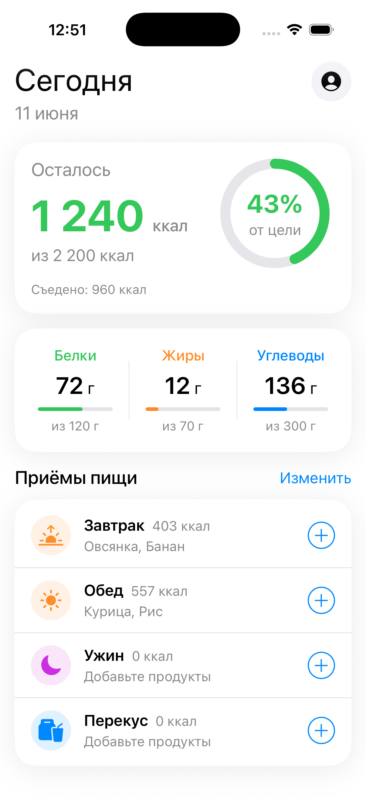
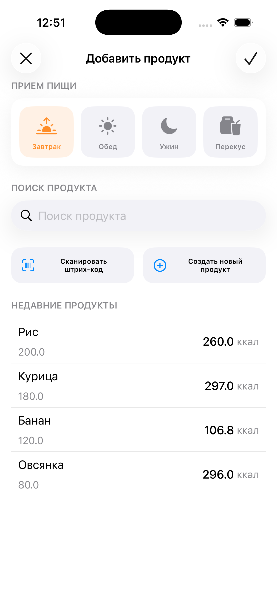

# SnackTrack

iOS-приложение для ведения дневника питания, отслеживания калорий и БЖУ.

Проект находится в разработке и используется как pet-проект для практики UIKit, MVVM, Combine и построения интерфейса кодом.

## Скриншоты

<table>
  <tr>
    <td></td>
    <td></td>
  </tr>
  <tr>
    <td align="center">Главный экран</td>
    <td align="center">Добавление продукта</td>
  </tr>
</table>

## Возможности

- дневник питания за текущий день;
- сводка по калориям: цель, съедено, осталось и круговой прогресс;
- сводка по БЖУ с прогрессом по каждому макронутриенту;
- список приёмов пищи с продуктами и калориями;
- переход на экран добавления продукта из выбранного приёма пищи;
- выбор приёма пищи на экране добавления продукта;
- отображение поля поиска и списка недавних продуктов.

## Стек

- Swift
- UIKit
- SnapKit
- Combine
- MVVM
- Coordinator
- Programmatic UI

## Архитектура

Проект разделён на несколько основных частей:

- `App` отвечает за запуск приложения и навигацию. `AppCoordinator` создаёт корневой `UINavigationController`, открывает главный экран и пушит экран добавления продукта.
- `Core` содержит доменные модели, сервис расчёта пищевой ценности и протокол хранилища.
- `Features/Diary` содержит главный экран дневника: `ViewModel` получает данные из хранилища, маппер готовит view data, `ViewController` подписывается на состояние и обновляет UI.
- `Features/AddProduct` содержит экран добавления продукта: `ViewModel` формирует состояние с учётом выбранного приёма пищи, а `ViewController` связывает UI-события с ViewModel.
- `DiaryStorageProtocol` отделяет источник данных от экранов. Сейчас используется `InMemoryDiaryStorage` с тестовыми данными.

Основные экраны собираются кодом без Storyboard; Storyboard используется только для launch screen.

## Структура проекта

```text
SnackTrack/
├── App/
│   ├── AppDelegate.swift
│   ├── SceneDelegate.swift
│   └── Navigation/
│       ├── AppCoordinator.swift
│       └── ModuleBuilder.swift
├── Core/
│   ├── Extensions/
│   ├── Models/
│   ├── Services/
│   └── Storage/
├── Features/
│   ├── Diary/
│   │   ├── Models/
│   │   ├── Views/
│   │   ├── DiaryViewController.swift
│   │   ├── DiaryViewModel.swift
│   │   └── DiaryViewDataMapper.swift
│   └── AddProduct/
│       ├── Models/
│       ├── Views/
│       ├── AddProductBuilder.swift
│       ├── AddProductViewController.swift
│       └── AddProductViewModel.swift
└── Resources/
```

## Текущее состояние

Проект находится в активной разработке. На текущем этапе реализован основной сценарий просмотра дневника питания: отображение текущего дня, расчёт калорий и БЖУ, список приёмов пищи и переход на экран добавления продукта.

Экран добавления продукта пока работает как заготовка flow: он отображает выбор приёма пищи, поле поиска, кнопки действий и список недавних продуктов. Выбор приёма пищи подключён к состоянию экрана.

Данные берутся из `InMemoryDiaryStorage` с тестовым набором продуктов и приёмов пищи. Сохранение данных между запусками приложения и добавление выбранного продукта в дневник пока не реализованы.

## В планах

- сохранение данных между запусками приложения;
- создание пользовательских продуктов;
- сохранение выбранного продукта в выбранный приём пищи;
- поиск продуктов;
- сканирование штрих-кода;
- настройка дневных целей по калориям и БЖУ;
- улучшение форматирования пищевой ценности и веса продуктов.

## Как запустить

1. Склонировать репозиторий.
2. Открыть `SnackTrack.xcodeproj` в Xcode.
3. Выбрать симулятор или устройство.
4. Запустить проект через Xcode.

SnapKit подключён через Swift Package Manager в настройках Xcode-проекта, дополнительные команды для установки зависимостей не требуются.

## Цель проекта

SnackTrack используется как pet-проект для практики:

- UIKit;
- MVVM;
- Combine;
- Coordinator;
- разделения ответственности между слоями;
- построения UI кодом;
- работы с состоянием экрана;
- организации feature-based структуры проекта.
